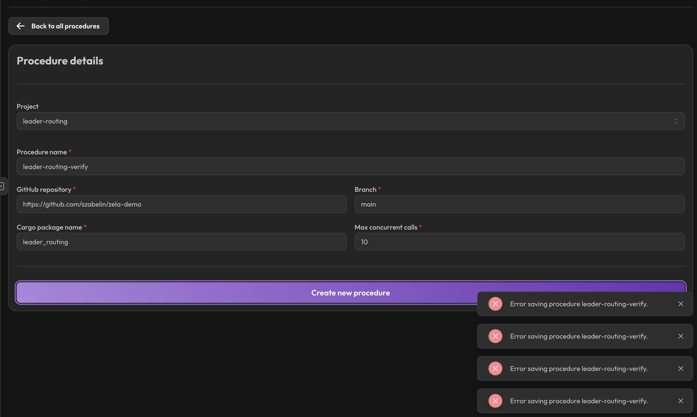
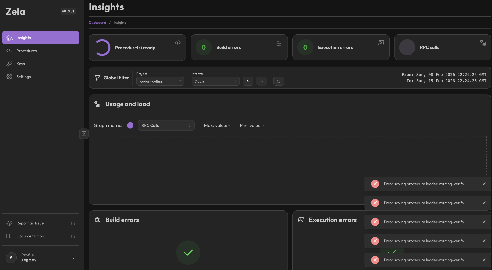
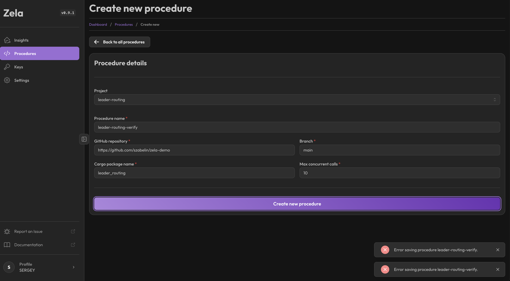

# Zela Platform Feedback

## Issues Encountered

### 1. Method Hash Discovery (UX Issue)
**Problem:** After deploying a procedure, finding the method hash to call the endpoint is not intuitive.

**Current workflow:**
1. Deploy procedure via Zela dashboard
2. Go to Procedures page
3. Find the commit hash in the Builds table
4. Manually construct: `zela.<procedure-name>#<commit-hash>`

**Suggestion:**
- Show the full callable method string prominently on the procedure detail page
- Add a "Copy method" button for easy copying
- Example display: `zela.deploy-leader-routing-RPC-v1#e409a0be04c7e9c39bc90b32d6827cf099581100`

### 2. Delete Old Procedures (Feature Request)
**Problem:** No visible way to delete old/unused procedures from the dashboard.

**Use case:**
- During development, multiple test deployments accumulate
- Old procedures clutter the Procedures list
- No cleanup mechanism visible in UI

**Suggestion:**
- Add a "Delete" button on procedure detail page
- Or add bulk delete from procedures list
- Consider soft-delete with recovery period

### 3. Real-time Dashboard Updates (Feature Request)
**Problem:** Dashboard requires manual refresh to see updated values (build status, metrics, logs).

**Current behavior:**
- Deploy a procedure → must refresh page to see build status change
- Insights/metrics don't update live
- No indication when data is stale

**Suggestion:**
- Add WebSocket connection for real-time updates
- Build status should update live (building → success/failed)
- Insights graphs should stream new data points
- Show "live" indicator when connected, "stale" when not

### 4. Generic Error Messages (UX Issue)
**Problem:** "Error saving procedure" gives no actionable information.

**Observed behavior:**
- Clicked "Create new procedure" with valid inputs
- Error toast: "Error saving procedure leader-routing-verify"
- No details about what failed (validation? build? network? name conflict?)
- Multiple identical error toasts stack up (5+ in screenshot)



**Suggestion:**
- Show specific error reason: "Build failed: cargo build error on line X"
- Or: "Name conflict: procedure already exists"
- Or: "GitHub access denied: check repository permissions"
- Deduplicate error toasts (show count instead of stacking)

### 5. No Build Logs Exposed (Feature Request)
**Problem:** Cannot diagnose why procedure creation fails.

**Observed behavior:**
- Procedure save fails with generic error
- "Build errors" section on Insights shows green checkmark (0 errors)
- No way to see what actually failed during the build
- Binary size (~17MB) confirmed acceptable by Zela team, so not the issue
- Completely blocked with no way to debug



**Suggestion:**
- Show build logs in procedure detail page
- Stream logs in real-time during build
- Keep last N build attempts with logs for debugging

### 6. Insights Page Empty/Not Loading (Bug)
**Problem:** Insights graphs show no data.

**Observed behavior:**
- Insights page shows "Max value: -" and "Min value: -"
- Graph area is completely empty
- Unsure if this is expected (no calls yet) or a loading issue



**Suggestion:**
- Show "No data yet" message instead of empty graph
- Or show loading spinner if data is being fetched
- Display explicit time range with data availability

### 7. WASM Build Fails with zstd-sys (Bug)
**Problem:** Build fails when compiling for `wasm32-wasip2` target.

**Error:**
```
error: unable to create target: 'No available targets are compatible with triple "wasm32-unknown-wasip2"'
zstd-sys C compilation fails
```

**Root cause:** The `zstd-sys` crate (dependency of zela-std) contains C code that doesn't compile for WASM targets. The clang compiler doesn't support `wasm32-wasip2` triple for C compilation.

**Suggestion:**
- Use pure-Rust zstd implementation (zstd-rs with pure feature)
- Or exclude zstd dependency for WASM builds
- This blocks any procedure with complex dependencies from deploying

### 8. Large Precomputed Data in Git (Architecture Issue)
**Problem:** 17MB of precomputed data (PHF maps) must be committed to repo for each deployment.

**Issues:**
- Git repos grow large with each epoch refresh (~every 2 days)
- GitHub has size limits and slows down with large files
- Data is environment-specific, not source code

**Suggestion:**
- Provide local/cloud storage for build artifacts
- Support build-time data fetching (e.g., from S3, GCS)
- Or provide a data layer API that procedures can call
- Keep code repo lightweight, data separate

### 9. Weekend Downtime (Reliability Issue)
**Problem:** Platform appears to have issues/downtime on weekends.

**Observed behavior:**
- Procedure creation fails with generic errors
- No status page or incident communication visible

**Suggestion:**
- Provide status page (e.g., status.zela.io)
- Alert users to planned maintenance
- Consider 24/7 support for production users

---

*Feedback from leader_routing development session - 15 Feb 2026*
